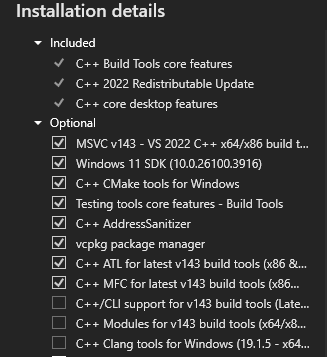
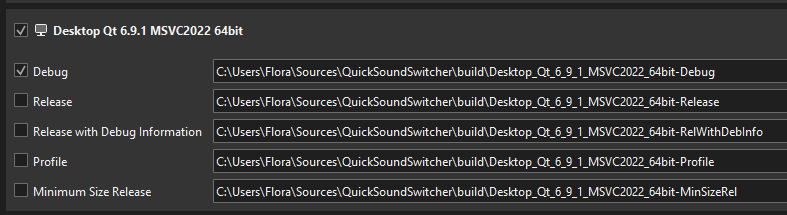
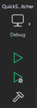

## Building QuickSoundSwitcher from sources

### Prerequistes
- Git for Windows (for commit extraction at build time)
- Microsoft Visual Studio Community 2022
- Latest stable Qt

### Git for windows

Download [Git for windows](https://git-scm.com/downloads/win).  
If you plan on using git to push your changes, you will have to configure it properly for your needs.  
If used only for build time commit extraction, we do not care. You can just install it with default configuration.

### MSVC 2022

Download [MSVC 2022](https://visualstudio.microsoft.com/fr/thank-you-downloading-visual-studio/?sku=Community&channel=Release&version=VS2022&source=VSLandingPage&cid=2030&passive=false)

Tick `Desktop development with C++`

Tick the following:

Wait for installation to complete and close visual studio editor.

### Qt

Download [Qt](https://www.qt.io/download-qt-installer-oss?hsLang=en). You will need an account.  
Fill in yout account information and tick `I'm an individual...`.

Untick Qt 6.9 for development and tick custom installation.  
We need the following:
- In Qt, expand last stable one (No beta, prerelease etc) and tick MSVC 2022 64 bit.
- Under Additional libraries, tick Qt Multimedia
- Under build tools, make sure Cmake and Ninja are checked
- Under QtCreator, tick QtCreator

You can then start the install

### Compiling the project

Open QtCreator, open project, and load QuickSoundSwitcher CMakeLists.txt.  
In the kit configuration, you can just leave it to default and click on configure project.

In QtCrator, bottom left, you can click the Run button.

Be sure to have closed any previous instance of QuickSoundSwitcher, or the new one will refuse to open.

Subsequant builds will be much faster than the initial one.