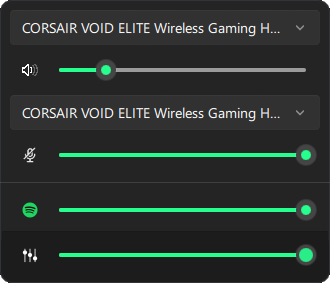

# QuickSoundSwitcher

[]()
[]()
[]()

QuickSoundSwitcher is an enhanced audio panel for Windows.  
It provide output and input volume / device / mute control as well as application volume mixer.  
It is made with close to native ui for w10 or w11.




## Usage

Left click on the tray icon to reveal the panel.  
Click anywhere to close the panel.

## Installation

### Using OPM

- Install OPM  
In windows terminal:
```
Invoke-Expression (New-Object System.Net.WebClient).DownloadString('https://raw.githubusercontent.com/Odizinne/opm/refs/heads/main/opm_install.ps1')
```

- Open a new windows terminal

- Install QuickSoundSwitcher  
In windows terminal:
```
opm update
opm install quicksoundswitcher
```

**QuickSoundSwitcher** will be available in your start menu.

### Manually

Download latest release, extract it, and run `QuickSoundSwitcher.exe`.

