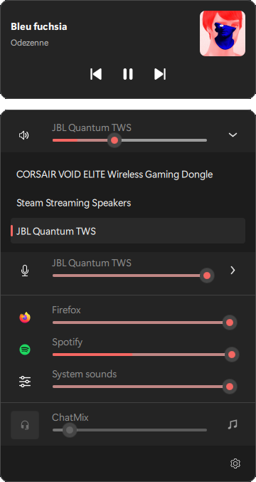

# QuickSoundSwitcher

Popup panel for controlling windows I/O audio devices.  
While default sound menu in quick access menu does the job, it does not support switching communication device nor input device.



## Usage

Left click on the tray icon to reveal the panel.  
Click anywhere or press `ESC` to close the panel.

`CTRL` + `ALT` + `M` will toggle microphone mute state.

A mute state overlay is available in application settings as well as a sound notification (disabled by default).

## Installation

### Using OPM

- Install OPM  
In windows terminal:
```
Invoke-Expression (New-Object System.Net.WebClient).DownloadString('https://raw.githubusercontent.com/Odizinne/opm/refs/heads/main/opm_install.ps1')
```

- Open a new windows terminal

- Install QuickSoundSwitcher  
In windows terminal:
```
opm update
opm install quicksoundswitcher
```

**QuickSoundSwitcher** will be available in your start menu.

### Manually

Download latest release, extract it, and run `QuickSoundSwitcher.exe`.

