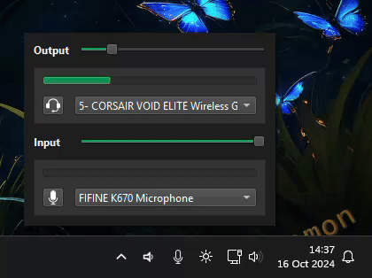

# QuickSoundSwitcher

Popup panel for controlling windows I/O audio devices.  
While default sound menu in quick access menu does the job, it does not support switching communication device nor input device.



## Requirements

- [AudioDeviceCmdlets](https://github.com/frgnca/AudioDeviceCmdlets)

## Usage

Left click on the tray icon to reveal the panel.

- Mic and Headset buttons act as mute toggle.
- You can change default output and input devices.  
This will set default both default (General sound)  
and communication (Discord, teams ...) for the selected device.
- Sliders act as volume sliders.

Click anywhere outside the panel to close it.

## Installation

### Manual

Download latest release, extract it, and run `QuickSoundSwitcher.exe`.

### Using OdizinnePackageManager

- Install OPM
```
Invoke-Expression (New-Object System.Net.WebClient).DownloadString('https://raw.githubusercontent.com/Odizinne/opm/refs/heads/main/opm_install.ps1')
```

- Install QuickSoundSwitcher 
```
opm update
opm install quicksoundswitcher
```

QuickSoundSwitcher will be available in your start menu.

## To-do

- Get rid of AudioDeviceCmdlets