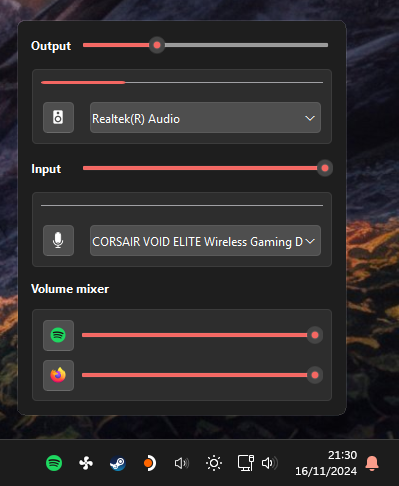

# QuickSoundSwitcher

Popup panel for controlling windows I/O audio devices.  
While default sound menu in quick access menu does the job, it does not support switching communication device nor input device.

## Requirements

- [AudioDeviceCmdlets](https://github.com/frgnca/AudioDeviceCmdlets)